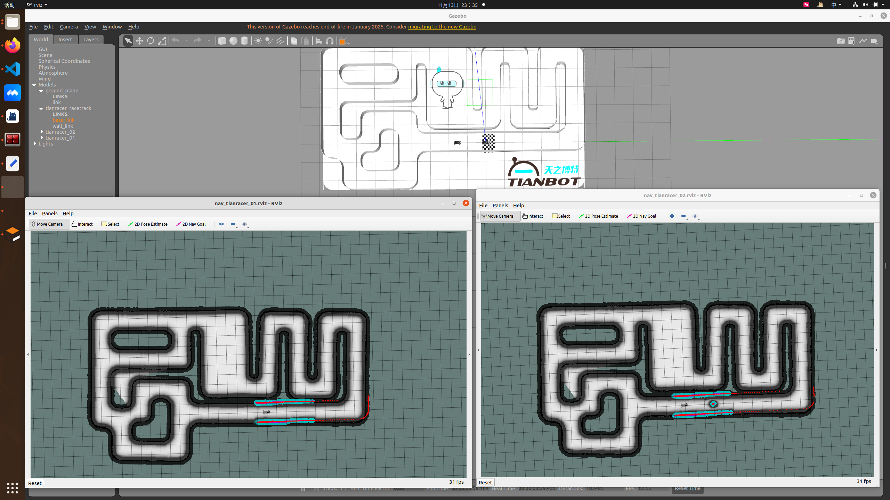
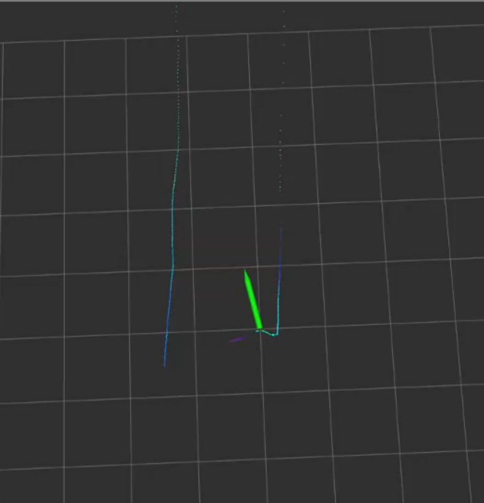

# Roboracer China 2025 — NPU-IUSL-TianRacer Team

**申达杯·Roboracer China 2025**

本仓库为 **NPU-IUSL-TianRacer 战队** 在 *Roboracer China 2025 申达杯* 比赛中的开源代码，包含完整的 ​**TianRacer 仿真环境**​，可用于算法验证、竞速策略开发以及实际演示。

本项目基于 ​**ROS + Gazebo**​，提供可直接运行的多车仿真、路径规划与竞速控制程序。
你可以直接运行我们的 baseline，也可以替换控制代码实现自己的竞速策略。

---

## ✨ 功能特性 Features

* 🚗 **TianRacer 赛车 Gazebo 仿真环境**
* 🛣️ **自动驾驶 / 竞速导航示例代码**
* ⚙️ **可替换的竞速算法脚本**
* 🧪 **仿真测试与竞速对比功能**

---

## 🛠️ 环境配置 Environment Setup

### 1. 创建工作空间 (推荐：catkin\_ws)

```bash
mkdir -p ~/catkin_ws/src
cd ~/catkin_ws/src
```

### 2. 克隆本仓库

```bash
git clone https://github.com/npu-ius-lab/Roboracer_China_2025.git
```

### 3. 编译工作空间

```bash
cd ..
catkin_make
source devel/setup.bash
```

---

## 🚀 仿真运行 Simulation Run

### **1. 启动 TianRacer 两车仿真环境**

```bash
roslaunch tianracer_gazebo demo_sim_two_tianracer.launch
```

### **2. 运行官方 baseline 算法**

```bash
rosrun tianracer_navigation use_to_battle_fast1.py
```

---

## 🔧 自定义算法开发 Customize Your Racing Algorithm

你可以修改/替换：

```
tianracer_navigation/use_to_battle_fast2.py
```

该脚本为 **用户自定义竞速策略** 的接口示例，你可以在里面加入自己的路径规划、控制、行为预测等算法。

开发完成后运行：

```bash
rosrun tianracer_navigation use_to_battle_fast2.py
```

---

## 🏁 竞速性能对比 Racing Comparison

若你想对比官方 baseline 与自己的算法：

* baseline：`use_to_battle_fast1.py`
* 自定义：`use_to_battle_fast2.py`

只需分别运行脚本并观察车辆圈速差异、路径轨迹与控制效果。

--

## 📷 仿真环境展示



---

## 📂 项目结构 Project Structure

```
Roboracer_China_2025/
├── tianracer_gazebo/        # 仿真世界、模型、场景
├── tianracer_navigation/    # 控制/导航算法
│   ├── use_to_battle_fast1.py   # baseline
│   ├── use_to_battle_fast2.py   # 自定义测试脚本
├── tianracer_description/   # URDF 车辆模型
└── README.md
```

## 调试Debug
由于反应式算法需要大量逻辑判断，人为定义规则处理大量corner case。通过发布车辆前进方向，并利用Rviz进行可视化可以辅助调试。


## 🤝 致谢 Acknowledgment

本项目由 [**西北工业大学·智能无人系统实验室（IUS-Lab）TianRacer 战队**](https://github.com/npu-ius-lab) 开发，用于推动学生在智能赛车、自主控制与机器人系统方向的学习与创新。
特别感谢 [**天之博特（Tianbot）**](https://github.com/tianbot) 的大力支持！


